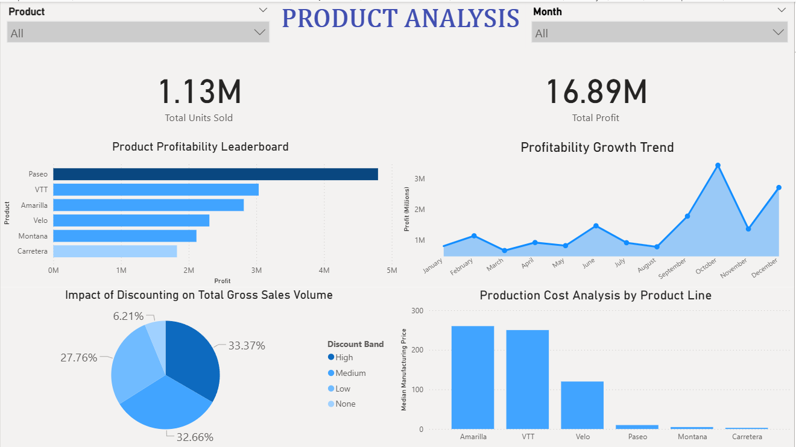

# 📦 Product Analysis Dashboard

An interactive Power BI dashboard analyzing product profitability,
discount impact, and production costs across all product lines.

---

## 🛠️ Tools Used
Power BI | Excel

---

## 📸 Preview

---

## ✨ What It Shows
- **KPIs** — Total Units Sold (1.13M) & Total Profit (16.89M)
- **Profitability Leaderboard** — Paseo leads, followed by VTT & Amarilla
- **Growth Trend** — Profit peaks in October, dips in November
- **Discount Impact** — High (33.37%) & Medium (32.66%) discounts dominate sales volume
- **Production Cost** — Amarilla & VTT have highest manufacturing costs

---

## 💡 Key Finding
Paseo is the most profitable product despite Amarilla
and VTT having the highest production costs — showing
that lower cost products can still dominate in profit.

---

## 👤 Manish_Ghatori — Aspiring Data Analyst
📧 manish0075564@gmail.com | 🔗 www.linkedin.com/in/manish-ghatori-2297ba3a2
