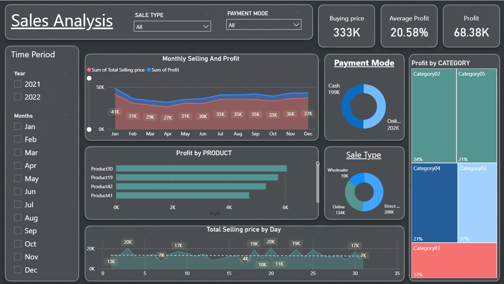

# 📊 Data Visualization Projects

---

# 📦 Product Analysis Dashboard
An interactive Power BI dashboard analyzing product
profitability, discount impact and production costs.

## Preview

## What It Shows
- KPIs — Total Units Sold (1.13M) & Total Profit (16.89M)
- Paseo leads in profitability
- October peaks in profit growth
- High discounts dominate sales volume

---

# 💰 Sales Analysis Dashboard
An interactive Power BI dashboard analyzing sales
performance across products, categories and payment modes.

## Preview

## What It Shows
- KPIs — Buying Price (333K), Avg Profit (20.58%), Total Profit (68.38K)
- Direct sales dominate at 208K
- Product30 leads in profit
- Cash vs Online payments nearly equal

---

## 🛠️ Tools Used
Power BI | Excel

## 👤 Manish Ghatori — Aspiring Data Analyst
📧 manish0075564@gmail.com | 🔗 linkedin.com/in/manish-ghatori-2297ba3a2
